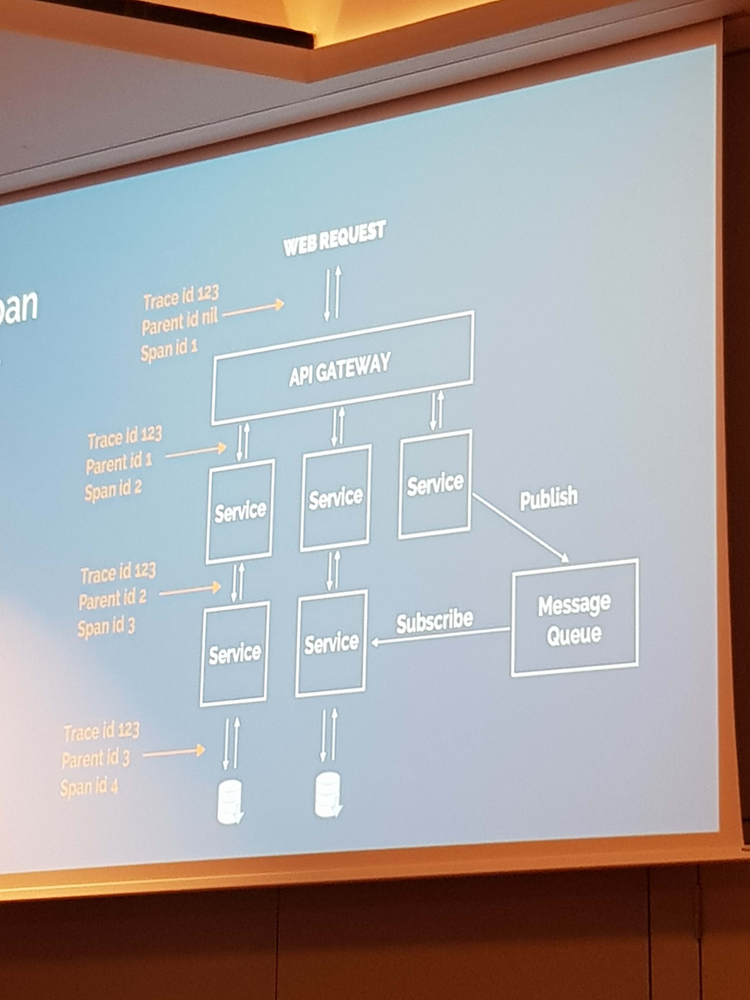

# GopherCon EU2019 Notes

## [Ultimate Go](https://github.com/ardanlabs/gotraining/blob/master/topics/courses/go/README.md) Workshop Takeaways

Review course materials, specifically:
 
* [Profiling](https://github.com/ardanlabs/gotraining/blob/master/topics/courses/go/tooling/README.md)
* [Data Semantics](https://github.com/ardanlabs/gotraining/blob/67e33a36da51d394b0fe6f925b8023e10a29878d/topics/go/language/methods/example5/example5.go)
* [Concurrency](https://github.com/ardanlabs/gotraining/blob/master/topics/courses/go/concurrency/README.md)
* [More on Data Semantics and Escape Analysis](https://www.ardanlabs.com/blog/2017/05/language-mechanics-on-stacks-and-pointers.html)

### Guidelines

#### On data semantics (when to use value versus pointer semantics)

Don't mix value and pointer semantics in a function.

##### Built-in types

Pass built-in types using value semantics.
**Exception**: if we want nils - only then is it okay to use pointer semantics. Comment these instances

Value semantics is the safest way to do mutation.

##### Reference types - arrays, slices, maps, interfaces, functions

Use value semantics to pass these around. **Exception**: unless you're writing to it.

#### Other 

* Method receivers can be value or pointer - can call these in either way.

* Use functions until it's not practical anymore, then use methods on a struct.

* Methods allow _data_ to exhibit behaviour.

* Use var to always get a zero value, e.g.
```
var u User
```
is better than the code below, which may or may not give you a zero value. Using `var` always will.
```
u := User()
``` 

* go routines - fan out pattern vs pooling pattern, be aware of how these differ.

## Psychology of Code Readability
[@egonelbre](https://twitter.com/egonelbre)

* [Slides](https://t.co/pcN9bw3XuO)
* [Psychology of Code Readability](https://medium.com/@egonelbre/psychology-of-code-readability-d23b1ff1258a)
* [Paradigm is not the Implementation](https://medium.com/@egonelbre/paradigm-is-not-the-implementation-af4c1489c073)
* [What is a Layer?](https://medium.com/@egonelbre/what-is-a-layer-948bb1a26b5d)
* [Thoughts on Code Organization](https://medium.com/@egonelbre/thoughts-on-code-organization-c668e7cc4b96)


## Finding Dependable Go Packages

[@JQiu25](https://twitter.com/JQiu25)

[Slides](https://speakerdeck.com/julieqiu/finding-dependable-go-packages)

### Overview
There are three stages:

### Discovery 
* Ask Twitter 
* Google
* Github

### Evaluate 
1. License
2. Popularity - Stats on github - is it forked, depended on a lot, contributed to recently? 
3. Code quality - is documentation comprehensive, good tests, is it clear idiomatic Go code?
4. Upkeep - are the contributors well regarded, active? Do issues get responded to?
5. Indirect dependencies - check the package's packages!

### Maintenance 
* Stay up to date with packages
* Maybe contribute to them

The Go team is working on a site for discovering and evaluating packages.

## Rethinking Visual Programming
* [@idanyliuk](https://twitter.com/idanyliuk)
* [Rethinking Visual Programming with Go](https://divan.dev/posts/visual_programming_go/)
* [Hacker News Discussion](https://news.ycombinator.com/item?id=20100376)

## Distributed Tracing
[Jaegar Tracing](https://www.jaegertracing.io/)



## [How I write Go HTTP services after seven years](https://medium.com/statuscode/how-i-write-go-http-services-after-seven-years-37c208122831)
Basis for [Mat Ryer's](https://twitter.com/matryer) talk.

Here's his code for [randomly selecting a speaker](https://gist.github.com/matryer/cb8c249b3d4a2dc3d4f0d00d3b1aba45).

## Tools
* [GraphViz](http://graphviz.org/)

## Refactor Considerations
* get it working first
* refactor, make interfaces where appropriate
* profile
* readability according to 4±1 items working memory idea, things need to be in chunks

## Links

* [GoBridge](https://github.com/gobridge/about-us/blob/master/README.md)
* [Go Report Card](https://goreportcard.com/)
* [Golang Weekly (email newsletter)](https://golangweekly.com/issues/264)
* [Go Time Podcast](https://changelog.com/gotime)
* [r/golang](https://www.reddit.com/r/golang/)
